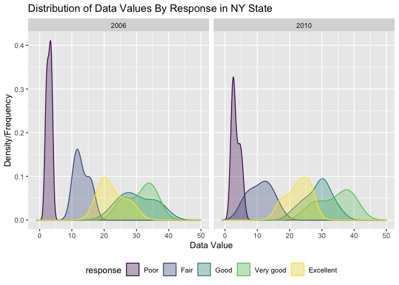
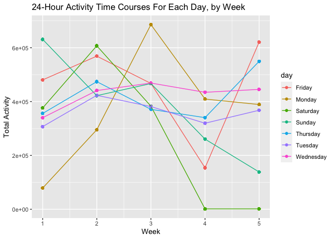

Data Science I Homework 3 - lzs2109
================
Louis Sharp
10/12/2021

### **Problem 1**

``` r
library(tidyverse)
library(p8105.datasets)
```

``` r
data("instacart")
```

This instacart dataset includes a bunch of information about orders
placed on the online grocery delivery service Instacart. Variables
include order\_id, product\_id, add\_to\_cart\_order, reordered,
user\_id, eval\_set, order\_number, order\_dow, order\_hour\_of\_day,
days\_since\_prior\_order, product\_name, aisle\_id, department\_id,
aisle, department, which describe unique identifiers used by the app and
identifiers for products, orders, aisles, departments, and users. In
addition, information on how many of the unique items were added to
carts, reordered, what day of the week they were ordered, what hour of
the day, and how long since the last order of that particular item are
inlcuded. Finally, product information including the department and
aisle in which they are located are available, as well as the specific
product names. This dataset contains a lot of information, with 1384617
observations (over one and a quarter million!) and 15 variables.

``` r
instacart %>% 
  group_by(aisle) %>% 
  count() %>% 
  arrange(desc(n))
```

    ## # A tibble: 134 × 2
    ## # Groups:   aisle [134]
    ##    aisle                              n
    ##    <chr>                          <int>
    ##  1 fresh vegetables              150609
    ##  2 fresh fruits                  150473
    ##  3 packaged vegetables fruits     78493
    ##  4 yogurt                         55240
    ##  5 packaged cheese                41699
    ##  6 water seltzer sparkling water  36617
    ##  7 milk                           32644
    ##  8 chips pretzels                 31269
    ##  9 soy lactosefree                26240
    ## 10 bread                          23635
    ## # … with 124 more rows

There are 134 different aisles in the dataset, with over 150,000 items
ordered from both the fresh vegetables and fresh fruits aisles. The next
most ordered from aisle is the packaged vegetables fruits aisle with
almost 78,500 items being ordered from it. The yogurt aisle is the next
and 4th most ordered from with over 55,000 items coming from it. The top
5 most ordered from aisles is rounded out with packaged cheese, at one
order shy of 41,700 orders.

Now, here’s a plot showing the number of items ordered in each aisle,
showing only aisles with over 10,000 items ordered. We can clearly see
the top 5 listed above, with water seltzer sparkling water coming in
closely at 6th, followed by milk at 7th, as in our list above. Orders
from the candy chocolate, dry pasta, oils vinegars, and butter aisles
seem to be just past the 10,000 orders mark, making them still quite
popular, but rounding out the bottom of the 10k+ list.

``` r
instacart %>% 
  group_by(aisle) %>% 
  summarize(n_obs = n()) %>% 
  filter(n_obs > 10000) %>% 
  ggplot(aes(y = reorder(aisle, n_obs), x = n_obs)) + 
  geom_col() +
  labs(title = "Items Ordered Per Aisle on Instacart", 
       x = "Number of Items Ordered", 
       y = "Aisle Name")
```

<!-- -->

Next, we’ll look at the top 3 most popular items from the aisles “baking
ingredients”, “dog food care”, and “packaged vegetables fruits”.

``` r
instacart %>% 
  filter(aisle == c("baking ingredients",
                    "dog food care",
                    "packaged vegetables fruits")) %>% 
  group_by(aisle, product_name) %>% 
  summarize(times_ordered = n()) %>% 
  mutate(product_rank = min_rank(desc(times_ordered))) %>% 
  filter(product_rank < 4) %>% 
  arrange(aisle, product_rank) %>% 
  relocate(product_rank, aisle, product_name, times_ordered) %>% 
  knitr::kable()
```

    ## `summarise()` has grouped output by 'aisle'. You can override using the `.groups` argument.

| product\_rank | aisle                      | product\_name                                   | times\_ordered |
|--------------:|:---------------------------|:------------------------------------------------|---------------:|
|             1 | baking ingredients         | Light Brown Sugar                               |            157 |
|             2 | baking ingredients         | Pure Baking Soda                                |            140 |
|             3 | baking ingredients         | Organic Vanilla Extract                         |            122 |
|             1 | dog food care              | Organix Grain Free Chicken & Vegetable Dog Food |             14 |
|             2 | dog food care              | Organix Chicken & Brown Rice Recipe             |             13 |
|             3 | dog food care              | Original Dry Dog                                |              9 |
|             1 | packaged vegetables fruits | Organic Baby Spinach                            |           3324 |
|             2 | packaged vegetables fruits | Organic Raspberries                             |           1920 |
|             3 | packaged vegetables fruits | Organic Blueberries                             |           1692 |

Brown sugar seems to be the most commonly ordered item from the baking
ingredients aisle, followed by baking soda and organic vanilla extract.
I suppose a lot of people are baking cookies and cakes! The dog food
care aisle doesn’t seem to get a ton of orders on instacart, as the most
common items are ordered less than 15 times. Those include “Organix” dog
foods and something called Original Dry Dog..? Most likely a type of dry
kibble dog food. Finally, the packaged vegetables fruits aisle is quite
popular, as we saw above, and gets thousands of orders for organic
spinach mostly, followed by organic berries.

Next, let’s explore what mean hour of the day Pink Lady Apples and
Coffee Ice Cream are ordered on each day of the week, with a column for
each day of the week and a row for each of the two items.

``` r
instacart %>% 
  select(order_hour_of_day, order_dow, product_name) %>% 
  filter(product_name == "Pink Lady Apples" | product_name == "Coffee Ice Cream") %>% 
  group_by(product_name, order_dow) %>% 
  summarize(mean_hour = mean(order_hour_of_day)) %>% 
  mutate(mean_hour = round(mean_hour),
         mean_hour = as.integer(mean_hour),
         days_of_week = c("Sunday", "Monday", "Tuesday", 
                          "Wednesday", "Thursday", "Friday", "Saturday")) %>% 
  select(-order_dow) %>% 
  pivot_wider(
    names_from = days_of_week, 
    values_from = mean_hour) %>% 
  knitr::kable(caption = "**Mean Times (24hr) Ordered by Day**")
```

    ## `summarise()` has grouped output by 'product_name'. You can override using the `.groups` argument.

| product\_name    | Sunday | Monday | Tuesday | Wednesday | Thursday | Friday | Saturday |
|:-----------------|-------:|-------:|--------:|----------:|---------:|-------:|---------:|
| Coffee Ice Cream |     14 |     14 |      15 |        15 |       15 |     12 |       14 |
| Pink Lady Apples |     13 |     11 |      12 |        14 |       12 |     13 |       12 |

**Mean Times (24hr) Ordered by Day**

This table has the hours rounded off, seeing as how in the original
table the numbers were formatted as base ten decimals, which gave a
result that didn’t look like times. In addition, not rounding off made
hours like 11.83 and 11.33 both appear as 11, which also doesn’t seem to
accurately reflect the average hour of the orders. As such, people seem
to be ordering coffee ice cream later in the day, primarily in the
afternoons (except Fridays), perhaps for an extra (and sweet) boost of
caffeine late in the day. Or maybe they just plan to watch Netflix and
eat coffee ice cream when they get home from work in the afternoon. Pink
lady apples, on the other hand, seem to be ordered mostly around
mid-day.

### **Problem 2**

``` r
data("brfss_smart2010")
```

``` r
brfss_smart2010 = brfss_smart2010 %>% 
  janitor::clean_names() %>% 
  rename(state = locationabbr,
         county = locationdesc,
         resp_id = respid) %>% 
  filter(topic == "Overall Health") %>% 
  mutate(response = factor(response, 
                           ordered = TRUE, 
                           levels = c("Poor", "Fair", "Good", "Very good", "Excellent")))

#filtering by "Overall Health" seems to have eliminated all responses other
#than those from Poor to Excellent, so no additional code for that is needed.

brfss_smart2010 #outputting table since it was saved as a tidied table above
```

    ## # A tibble: 10,625 × 23
    ##     year state county   class  topic  question   response sample_size data_value
    ##    <int> <chr> <chr>    <chr>  <chr>  <chr>      <ord>          <int>      <dbl>
    ##  1  2010 AL    AL - Je… Healt… Overa… How is yo… Excelle…          94       18.9
    ##  2  2010 AL    AL - Je… Healt… Overa… How is yo… Very go…         148       30  
    ##  3  2010 AL    AL - Je… Healt… Overa… How is yo… Good             208       33.1
    ##  4  2010 AL    AL - Je… Healt… Overa… How is yo… Fair             107       12.5
    ##  5  2010 AL    AL - Je… Healt… Overa… How is yo… Poor              45        5.5
    ##  6  2010 AL    AL - Mo… Healt… Overa… How is yo… Excelle…          91       15.6
    ##  7  2010 AL    AL - Mo… Healt… Overa… How is yo… Very go…         177       31.3
    ##  8  2010 AL    AL - Mo… Healt… Overa… How is yo… Good             224       31.2
    ##  9  2010 AL    AL - Mo… Healt… Overa… How is yo… Fair             120       15.5
    ## 10  2010 AL    AL - Mo… Healt… Overa… How is yo… Poor              66        6.4
    ## # … with 10,615 more rows, and 14 more variables: confidence_limit_low <dbl>,
    ## #   confidence_limit_high <dbl>, display_order <int>, data_value_unit <chr>,
    ## #   data_value_type <chr>, data_value_footnote_symbol <chr>,
    ## #   data_value_footnote <chr>, data_source <chr>, class_id <chr>,
    ## #   topic_id <chr>, location_id <chr>, question_id <chr>, resp_id <chr>,
    ## #   geo_location <chr>

For the years 2002 and 2010, we want to determine which states were
observed at 7 or more locations, renamed to “county” in this dataset.
Below, we’ll investigate that.

``` r
brfss_smart2010 %>% 
  filter(year == 2002) %>% 
  select(year, state, county) %>% 
  group_by(year, state) %>% 
  distinct() %>% 
  summarize(n_county = n()) %>% 
  filter(n_county > 6)
```

    ## `summarise()` has grouped output by 'year'. You can override using the `.groups` argument.

    ## # A tibble: 6 × 3
    ## # Groups:   year [1]
    ##    year state n_county
    ##   <int> <chr>    <int>
    ## 1  2002 CT           7
    ## 2  2002 FL           7
    ## 3  2002 MA           8
    ## 4  2002 NC           7
    ## 5  2002 NJ           8
    ## 6  2002 PA          10

It looks like in 2002, only six states were observed at 7 or more
locations/counties. These states included Connecticut (7 counties),
Florida (7 counties), Massachusets (8 counties), North Carolina (7
counties), New Jersey (8 counties), and Pennsylvania (10 counties). None
were observed at more than 10 counties or locations.

``` r
brfss_smart2010 %>% 
  filter(year == 2010) %>% 
  select(year, state, county) %>% 
  group_by(year, state) %>% 
  distinct() %>% 
  summarize(n_county = n()) %>% 
  filter(n_county > 6)
```

    ## `summarise()` has grouped output by 'year'. You can override using the `.groups` argument.

    ## # A tibble: 14 × 3
    ## # Groups:   year [1]
    ##     year state n_county
    ##    <int> <chr>    <int>
    ##  1  2010 CA          12
    ##  2  2010 CO           7
    ##  3  2010 FL          41
    ##  4  2010 MA           9
    ##  5  2010 MD          12
    ##  6  2010 NC          12
    ##  7  2010 NE          10
    ##  8  2010 NJ          19
    ##  9  2010 NY           9
    ## 10  2010 OH           8
    ## 11  2010 PA           7
    ## 12  2010 SC           7
    ## 13  2010 TX          16
    ## 14  2010 WA          10

By 2010, fourteen different states were observed at 7 or more locations.
These states include five of the six from 2002 (not Connecticut), as
well as California, Colorado, Maryland, Nebraska, New York, Ohio, South
Carolina, Texas, and Washington. All of the states that appeared on the
2002 list and the 2010 list were observed at more locations in 2010 with
the exception of Pennsylvania, which dropped from 10 locations in 2002
to 7 in 2010. Please see the list for number of locations observed for
each state.

``` r
brfss_smart2010 %>% 
  filter(response == "Excellent") %>% 
  select(year, state, county, data_value) %>% 
  group_by(year, state) %>% 
  summarize(mean_data_value = mean(data_value)) %>%
  ggplot(aes(x = year, y = mean_data_value, color = state)) +
  geom_line(aes(group = state), alpha = 0.6) + #not sure if the group aesthetic made a difference..
  labs(title = "Average 'Excellent' Response Data Value Over Time Per State",
       y = "Average Data Value", x = "Year")
```

    ## `summarise()` has grouped output by 'year'. You can override using the `.groups` argument.

    ## Warning: Removed 3 row(s) containing missing values (geom_path).

<!-- -->

The spaghetti plot is pretty busy so it’s difficult to discern any
useful information from it for individual states. Overall though, the
range of average data values across states ranges from about 17 on the
low end to about 29 on the high end, with most states being between 20
and 25. It seems like most states, if not all, start off with higher
averages in 2002 and end with lower averages in 2010, meaning that the
average data value of “Excellent” responses goes down over this 8 year
period from 2002 to 2010. This could be attributable to the fact that,
as mentioned above, many states had been observed in more locations in
2010 than in 2002, adding more data points that could have brought the
average data value down if, for example, the new locations were in areas
where people with “Excellent” health responses were rated lower than in
the previous locations observed.

``` r
brfss_smart2010 %>% 
  filter(state == "NY",
         year == 2006 | year == 2010) %>% 
  select(year, state, county, response, data_value) %>% 
  ggplot(aes(x = data_value, color = response, fill = response)) + 
  geom_density(alpha = .3) +
  labs(title = "Distribution of Data Values By Response in NY State",
       x = "Data Value", y = "Density/Frequency") +
  xlim(-1, 50) +
  theme(legend.position = "bottom") +
  facet_grid(. ~ year)
```

<!-- -->

Above is a plot showing the distribution of data values for the ordered
responses from “Poor” to “Excellent” among locations in New York state
in 2006 and 2010. As we can see, the “Poor” responses are all clustered
tightly between data values 0-5 for 2006, and a little more spread in
2010 between data values 0-8 or so, but still tightly clustered. The
height of the peaks shows that many of the values for the “Poor”
response are in the same small window. In 2006, the “Fair” responses
also encompass a smaller range than in 2010, where the peak smooths out
a little and also captures a wider range of data values. Interestingly,
the “Excellent” responses for both years appear to capture values more
in the range between “Fair” and “Good”/“Very good”. This seems unusual,
but consistent across both years. The “Good” values for both years
appear consistently higher, in general, than those of “Excellent”
responses, with a lot of overlap between the high range of “Excellent”,
the low range of “Very good” and the overall “Good” responses in 2006.
They seem more separate in 2010, but still with a considerable amount of
overlap. Finally, the “Very good” responses seems to have a higher
distribution of high data values in 2006 than any other response, and
this becomes more apparent in the 2010 data. There is however, as
mentioned above, a lot of overlap between these three highest responses,
but still a demarcation where the “Excellent” responses seem to have
lower values than the “Good” responses, which in turn have lower values
than “Very good” responses, which have the highest values.

### **Problem 3**

``` r
accel_df = read_csv("data/accel_data.csv") %>% 
  janitor::clean_names() %>% 
  pivot_longer(activity_1:activity_1440, 
               names_to = "minute",
               names_prefix = "activity_",
               values_to = "activity_level") %>% 
  mutate(part_of_week = ifelse(day == "Saturday" | day == "Sunday", "weekend", "weekday"),
  minute = as.numeric(minute))
```

    ## Rows: 35 Columns: 1443

    ## ── Column specification ────────────────────────────────────────────────────────
    ## Delimiter: ","
    ## chr    (1): day
    ## dbl (1442): week, day_id, activity.1, activity.2, activity.3, activity.4, ac...

    ## 
    ## ℹ Use `spec()` to retrieve the full column specification for this data.
    ## ℹ Specify the column types or set `show_col_types = FALSE` to quiet this message.

This tidied accelerometer dataset includes the following variables:
week, day\_id, day, minute, activity\_level, part\_of\_week with an
observation for every minute of every day over a 5 week period. If you
didn’t feel like doing the math, that’s a total of 50400 observations of
accelerometer filled fun! But seriously, this dataset is important
information because it follows a man in his 60s with a normal range BMI
who was diagnosed with congestive heart failure, and thus
around-the-clock observations of his activity level were important for
health and medical purposes. As such, the dataset is very precise,
broken down by a numerical activity level for every minute of every day
for the whole 5 week period, with variables identifying what day of the
week and whether it was a weekday or weekend for precise analysis.

``` r
accel_df = accel_df %>% 
  group_by(day_id) %>% 
  mutate(total_activity = sum(activity_level))

accel_df %>% 
  group_by(day_id, day, week, total_activity) %>% 
  summarize()
```

    ## `summarise()` has grouped output by 'day_id', 'day', 'week'. You can override using the `.groups` argument.

    ## # A tibble: 35 × 4
    ## # Groups:   day_id, day, week [35]
    ##    day_id day        week total_activity
    ##     <dbl> <chr>     <dbl>          <dbl>
    ##  1      1 Friday        1        480543.
    ##  2      2 Monday        1         78828.
    ##  3      3 Saturday      1        376254 
    ##  4      4 Sunday        1        631105 
    ##  5      5 Thursday      1        355924.
    ##  6      6 Tuesday       1        307094.
    ##  7      7 Wednesday     1        340115.
    ##  8      8 Friday        2        568839 
    ##  9      9 Monday        2        295431 
    ## 10     10 Saturday      2        607175 
    ## # … with 25 more rows

There aren’t any striking trends across the five weeks that really jump
out. Mid-week seems to be relatively less busy (Tues-Thurs) throughout
the 5 week period, and for the first three weeks, when there’s one busy
day on the weekend, the other seems relatively less busy. The two
Saturdays in weeks 4 and 5, nothing seems to be happening at all, which
is probably the most striking feature of this aggregated activity
dataset. The highest levels of activity for each week seem to happen
between Friday-Monday, with the exception of week 4.

``` r
accel_df %>% 
  ggplot(aes(x = week, y = total_activity, color = day)) +
  geom_point() +
  geom_path()
```

<!-- -->
