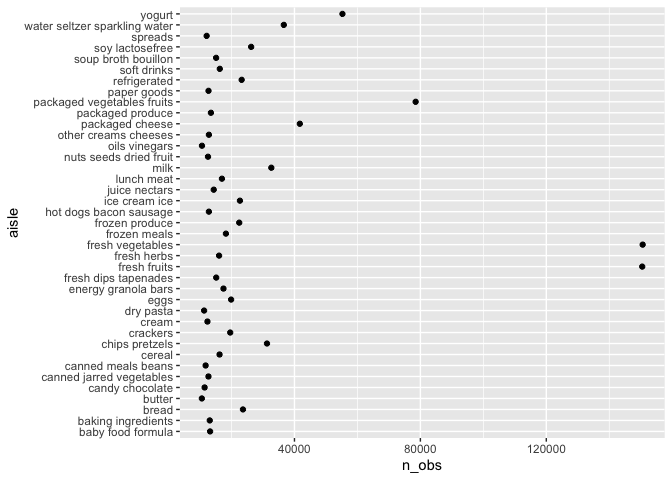

Data Science I Homework 3 - lzs2109
================
Louis Sharp
10/12/2021

### **Problem 1**

``` r
library(tidyverse)
library(p8105.datasets)
data("instacart")
```

Insert paragraph describing dataset

``` r
instacart %>% 
  group_by(aisle) %>% 
  summarize(n_obs = n()) %>% 
  arrange(desc(n_obs))
```

    ## # A tibble: 134 × 2
    ##    aisle                          n_obs
    ##    <chr>                          <int>
    ##  1 fresh vegetables              150609
    ##  2 fresh fruits                  150473
    ##  3 packaged vegetables fruits     78493
    ##  4 yogurt                         55240
    ##  5 packaged cheese                41699
    ##  6 water seltzer sparkling water  36617
    ##  7 milk                           32644
    ##  8 chips pretzels                 31269
    ##  9 soy lactosefree                26240
    ## 10 bread                          23635
    ## # … with 124 more rows

There are 134 different aisles in the dataset, with over 150,000 items
ordered from both the fresh vegetables and fresh fruits aisles. The next
most ordered from aisle is the packaged vegetables fruits aisle with
almost 78,500 items being ordered from it.

Now, here’s a plot showing the number of items ordered in each aisle,
with only aisles with over 10,000 items included.

``` r
instacart %>% 
  group_by(aisle) %>% 
  summarize(n_obs = n()) %>% 
  filter(n_obs > 10000) %>% 
  ggplot(aes(y = aisle, x = n_obs)) + 
  geom_point()
```

<!-- -->

Next, we’ll look at the top 3 most popular items from the aisles “baking
ingredients”, “dog food care”, and “packaged vegetables fruits”.

``` r
instacart %>% 
  filter(aisle == c("baking ingredients",
                    "dog food care",
                    "packaged vegetables fruits")) %>% 
  group_by(aisle, product_name) %>% 
  summarize(n_obs = n()) %>% 
  mutate(product_rank = min_rank(desc(n_obs))) %>% 
  filter(product_rank < 4) %>% 
  knitr::kable()
```

    ## `summarise()` has grouped output by 'aisle'. You can override using the `.groups` argument.

| aisle                      | product\_name                                   | n\_obs | product\_rank |
|:---------------------------|:------------------------------------------------|-------:|--------------:|
| baking ingredients         | Light Brown Sugar                               |    157 |             1 |
| baking ingredients         | Organic Vanilla Extract                         |    122 |             3 |
| baking ingredients         | Pure Baking Soda                                |    140 |             2 |
| dog food care              | Organix Chicken & Brown Rice Recipe             |     13 |             2 |
| dog food care              | Organix Grain Free Chicken & Vegetable Dog Food |     14 |             1 |
| dog food care              | Original Dry Dog                                |      9 |             3 |
| packaged vegetables fruits | Organic Baby Spinach                            |   3324 |             1 |
| packaged vegetables fruits | Organic Blueberries                             |   1692 |             3 |
| packaged vegetables fruits | Organic Raspberries                             |   1920 |             2 |

Next, let’s explore what mean hour of the day Pink Lady Apples and
Coffee Ice Cream are ordered on each day of the week, with a column for
each day of the week and a row for each of the two items.

``` r
instacart %>% 
  select(order_hour_of_day, order_dow, product_name) %>% 
  filter(product_name == "Pink Lady Apples" | product_name == "Coffee Ice Cream") %>% 
  group_by(product_name, order_dow) %>% 
  summarize(mean_hour = mean(order_hour_of_day)) %>% 
  pivot_wider(names_from = order_dow, values_from = mean_hour) %>% 
  knitr::kable()
```

    ## `summarise()` has grouped output by 'product_name'. You can override using the `.groups` argument.

| product\_name    |        0 |        1 |        2 |        3 |        4 |        5 |        6 |
|:-----------------|---------:|---------:|---------:|---------:|---------:|---------:|---------:|
| Coffee Ice Cream | 13.77419 | 14.31579 | 15.38095 | 15.31818 | 15.21739 | 12.26316 | 13.83333 |
| Pink Lady Apples | 13.44118 | 11.36000 | 11.70213 | 14.25000 | 11.55172 | 12.78431 | 11.93750 |

### **Problem 2**

``` r
data("brfss_smart2010")
```
