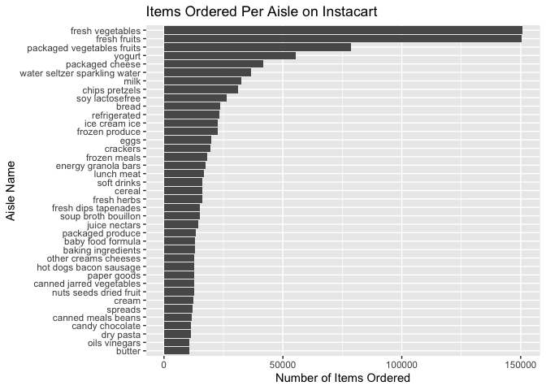
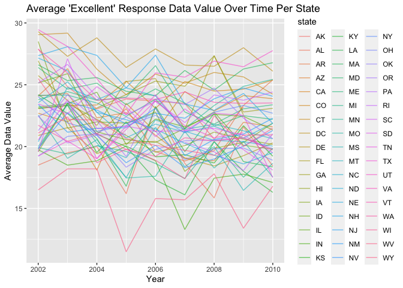

Data Science I Homework 3 - lzs2109
================
Louis Sharp
10/12/2021

### **Problem 1**

``` r
library(tidyverse)
library(p8105.datasets)
```

``` r
data("instacart")
```

This instacart dataset includes a bunch of information about orders
placed on the online grocery delivery service Instacart. Variables
include order\_id, product\_id, add\_to\_cart\_order, reordered,
user\_id, eval\_set, order\_number, order\_dow, order\_hour\_of\_day,
days\_since\_prior\_order, product\_name, aisle\_id, department\_id,
aisle, department, which describe unique identifiers used by the app and
for products, orders, aisles, departments, and users. In addition,
information on how many of the unique items were added to carts,
reordered, what day of the week they were ordered, what hour of the day,
and how long since the last order of that particular item are inlcuded.
Finally, product information including the department and aisle in which
they are located are available, as well as the specific product names.
This dataset contains a lot of information, with 1384617 observations
and 15 variables.

``` r
instacart %>% 
  group_by(aisle) %>% 
  count() %>% 
  arrange(desc(n))
```

    ## # A tibble: 134 × 2
    ## # Groups:   aisle [134]
    ##    aisle                              n
    ##    <chr>                          <int>
    ##  1 fresh vegetables              150609
    ##  2 fresh fruits                  150473
    ##  3 packaged vegetables fruits     78493
    ##  4 yogurt                         55240
    ##  5 packaged cheese                41699
    ##  6 water seltzer sparkling water  36617
    ##  7 milk                           32644
    ##  8 chips pretzels                 31269
    ##  9 soy lactosefree                26240
    ## 10 bread                          23635
    ## # … with 124 more rows

There are 134 different aisles in the dataset, with over 150,000 items
ordered from both the fresh vegetables and fresh fruits aisles. The next
most ordered from aisle is the packaged vegetables fruits aisle with
almost 78,500 items being ordered from it.

Now, here’s a plot showing the number of items ordered in each aisle,
with only aisles with over 10,000 items included.

``` r
instacart %>% 
  group_by(aisle) %>% 
  summarize(n_obs = n()) %>% 
  filter(n_obs > 10000) %>% 
  ggplot(aes(y = aisle, x = n_obs)) + 
  geom_col() +
  labs(title = "Items Ordered Per Aisle on Instacart", 
       x = "Number of Items Ordered", 
       y = "Aisle Name")
```

<!-- -->

Next, we’ll look at the top 3 most popular items from the aisles “baking
ingredients”, “dog food care”, and “packaged vegetables fruits”.

``` r
instacart %>% 
  filter(aisle == c("baking ingredients",
                    "dog food care",
                    "packaged vegetables fruits")) %>% 
  group_by(aisle, product_name) %>% 
  summarize(times_ordered = n()) %>% 
  mutate(product_rank = min_rank(desc(times_ordered))) %>% 
  filter(product_rank < 4) %>% 
  arrange(aisle, product_rank) %>% 
  relocate(product_rank, product_name, times_ordered, aisle) %>% 
  knitr::kable()
```

    ## `summarise()` has grouped output by 'aisle'. You can override using the `.groups` argument.

| product\_rank | product\_name                                   | times\_ordered | aisle                      |
|--------------:|:------------------------------------------------|---------------:|:---------------------------|
|             1 | Light Brown Sugar                               |            157 | baking ingredients         |
|             2 | Pure Baking Soda                                |            140 | baking ingredients         |
|             3 | Organic Vanilla Extract                         |            122 | baking ingredients         |
|             1 | Organix Grain Free Chicken & Vegetable Dog Food |             14 | dog food care              |
|             2 | Organix Chicken & Brown Rice Recipe             |             13 | dog food care              |
|             3 | Original Dry Dog                                |              9 | dog food care              |
|             1 | Organic Baby Spinach                            |           3324 | packaged vegetables fruits |
|             2 | Organic Raspberries                             |           1920 | packaged vegetables fruits |
|             3 | Organic Blueberries                             |           1692 | packaged vegetables fruits |

Next, let’s explore what mean hour of the day Pink Lady Apples and
Coffee Ice Cream are ordered on each day of the week, with a column for
each day of the week and a row for each of the two items.

``` r
instacart %>% 
  select(order_hour_of_day, order_dow, product_name) %>% 
  filter(product_name == "Pink Lady Apples" | product_name == "Coffee Ice Cream") %>% 
  group_by(product_name, order_dow) %>% 
  summarize(mean_hour = mean(order_hour_of_day)) %>% 
  mutate(mean_hour = as.integer(mean_hour)) %>% 
  pivot_wider(names_from = order_dow, values_from = mean_hour) %>% 
  knitr::kable()
```

    ## `summarise()` has grouped output by 'product_name'. You can override using the `.groups` argument.

| product\_name    |   0 |   1 |   2 |   3 |   4 |   5 |   6 |
|:-----------------|----:|----:|----:|----:|----:|----:|----:|
| Coffee Ice Cream |  13 |  14 |  15 |  15 |  15 |  12 |  13 |
| Pink Lady Apples |  13 |  11 |  11 |  14 |  11 |  12 |  11 |

### **Problem 2**

``` r
data("brfss_smart2010")

brfss_smart2010 = brfss_smart2010 %>% 
  janitor::clean_names() %>% 
  rename(state = locationabbr,
         county = locationdesc,
         resp_id = respid) %>% 
  filter(topic == "Overall Health") %>% 
  mutate(response = factor(response, 
                           ordered = TRUE, 
                           levels = c("Poor", "Fair", "Good", "Very good", "Excellent")))

#filtering by "Overall Health" seems to have eliminated all responses other
#than those from Poor to Excellent, so no additional code for that is needed.
```

For the years 2002 and 2010, we want to determine which states were
observed at 7 or more locations, renamed to “county” in this dataset.
Below, we’ll investigate that.

``` r
brfss_smart2010 %>% 
  filter(year == 2002) %>% 
  select(year, state, county) %>% 
  group_by(year, state) %>% 
  distinct() %>% 
  summarize(n_county = n()) %>% 
  filter(n_county > 6)
```

    ## `summarise()` has grouped output by 'year'. You can override using the `.groups` argument.

    ## # A tibble: 6 × 3
    ## # Groups:   year [1]
    ##    year state n_county
    ##   <int> <chr>    <int>
    ## 1  2002 CT           7
    ## 2  2002 FL           7
    ## 3  2002 MA           8
    ## 4  2002 NC           7
    ## 5  2002 NJ           8
    ## 6  2002 PA          10

It looks like in 2002, only six states were observed at 7 or more
locations or counties. These states included Connecticut (7 counties),
Florida (7 counties), Massachusets (8 counties), North Carolina (7
counties), New Jersey (8 counties), and Pennsylvania (10 counties). None
were observed at more than 10 counties or locations.

``` r
brfss_smart2010 %>% 
  filter(year == 2010) %>% 
  select(year, state, county) %>% 
  group_by(year, state) %>% 
  distinct() %>% 
  summarize(n_county = n()) %>% 
  filter(n_county > 6)
```

    ## `summarise()` has grouped output by 'year'. You can override using the `.groups` argument.

    ## # A tibble: 14 × 3
    ## # Groups:   year [1]
    ##     year state n_county
    ##    <int> <chr>    <int>
    ##  1  2010 CA          12
    ##  2  2010 CO           7
    ##  3  2010 FL          41
    ##  4  2010 MA           9
    ##  5  2010 MD          12
    ##  6  2010 NC          12
    ##  7  2010 NE          10
    ##  8  2010 NJ          19
    ##  9  2010 NY           9
    ## 10  2010 OH           8
    ## 11  2010 PA           7
    ## 12  2010 SC           7
    ## 13  2010 TX          16
    ## 14  2010 WA          10

By 2010, fourteen different states were observed at 7 or more locations.
These states include five of the six from 2002 (no Connecticut), as well
as California, Colorado, Maryland, Nebraska, New York, Ohio, South
Carolina, Texas, and Washington.

``` r
brfss_smart2010 %>% 
  filter(response == "Excellent") %>% 
  select(year, state, county, data_value) %>% 
  group_by(year, state) %>% #removed county .. ?
  summarize(mean_data_value = mean(data_value)) %>% 
  ggplot(aes(x = year, y = mean_data_value, color = state)) +
  geom_line()
```

    ## `summarise()` has grouped output by 'year'. You can override using the `.groups` argument.

    ## Warning: Removed 3 row(s) containing missing values (geom_path).

<!-- -->

The spaghetti plot is pretty busy so it’s difficult to discern any
useful information from it other than the fact that the range of average
data values across states ranges from about 17 on the low end to about
29 on the high end, with most states being between 20 and 25. It seems
like most states, if not all, start off with higher averages in 2002 and
end with lower averages in 2010, meaning that the average data value of
“Excellent” responses goes down over thie 8 year period.

``` r
brfss_smart2010 %>% 
  filter(state == "NY",
         year == 2006 | year == 2010) %>% 
  select(year, state, county, response, data_value) %>% 
  ggplot(aes(x = data_value, color = response)) + 
  geom_density() +
  facet_grid(. ~ year)
```

<!-- -->

### **Problem 3**

``` r
accel_df = read_csv("data/accel_data.csv") %>% 
  janitor::clean_names() %>% 
  pivot_longer(activity_1:activity_1440, 
               names_to = "minute",
               names_prefix = "activity_",
               values_to = "activity_level") %>% 
  mutate(part_of_week = ifelse(day == "Saturday" | day == "Sunday", "weekend", "weekday"),
  minute = as.numeric(minute))
```

    ## Rows: 35 Columns: 1443

    ## ── Column specification ────────────────────────────────────────────────────────
    ## Delimiter: ","
    ## chr    (1): day
    ## dbl (1442): week, day_id, activity.1, activity.2, activity.3, activity.4, ac...

    ## 
    ## ℹ Use `spec()` to retrieve the full column specification for this data.
    ## ℹ Specify the column types or set `show_col_types = FALSE` to quiet this message.

This tidied accelerometer dataset includes the following variables:
week, day\_id, day, minute, activity\_level, part\_of\_week with an
observation for every minute of every day over a 5 week period. If you
didn’t feel like doing the math, that’s a total of 50400 observations of
accelerometer filled fun! But seriously, this dataset is important
information because it follows a man in his 60s with a normal range BMI
who was diagnosed with congestive heart failure, and thus
around-the-clock observations of his activity level were important for
health and medical purposes. As such, the dataset is very precise,
broken down by a numerical activity level for every minute of every day
for the whole 5 week period, with variables identifying what day of the
week and whether it was a weekday or weekend for precise analysis.

``` r
accel_df = accel_df %>% 
  group_by(day_id) %>% 
  mutate(total_activity = sum(activity_level))

accel_df %>% 
  group_by(day_id, day, week, total_activity) %>% 
  summarize() %>% 
  view()
```

    ## `summarise()` has grouped output by 'day_id', 'day', 'week'. You can override using the `.groups` argument.

There aren’t any striking trends across the give weeks that really jump
out. Mid-week seems to be relatively less busy (Tues-Thurs) throughout
the 5 week period, and for the first three weeks, when there’s one busy
day on the weekend, the other seems relatively less busy. The two
Saturdays in weeks 4 and 5, nothing seems to be happening at all, which
is probably the most striking feature of this aggregated activity
dataset. The highest levels of activity for each week seem to happen
between Friday-Monday, with the exception of week 4.

``` r
accel_df %>% 
  ggplot(aes(x = day_id, y = total_activity, color = day)) +
  geom_point() +
  geom_line()
```

<!-- -->
